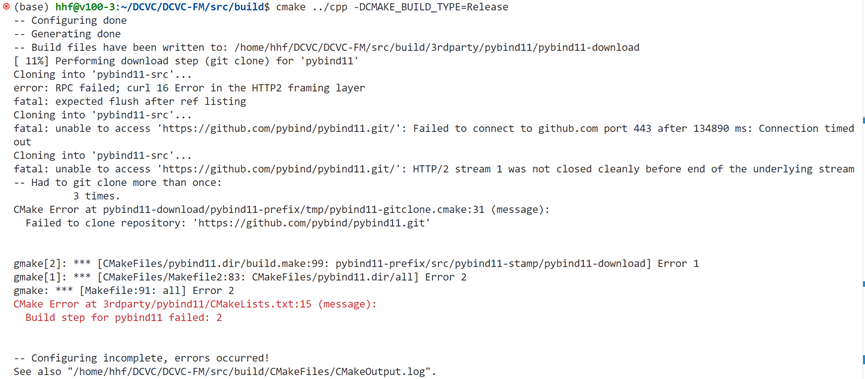

# bug memo_1
start from 2024/12/3

### No.1

或者是以下报错：
```
error: RPC failed; curl 16 HTTP/2 send again with decreased length
send-pack: unexpected disconnect while reading sideband packet
fatal: the remote end hung up unexpectedly
```

**成功解决：**[参考链接](https://blog.csdn.net/qq_45934285/article/details/131736984)
```
git config --global http.version HTTP/1.1
```


### No.2

`RuntimeError: Numpy is not available`
**成功解决：**[参考链接](https://blog.csdn.net/m0_51647880/article/details/140273540)


### No.3

`libstdc++.so.6: version  GLIBCXX_3.4.30 not found`

成功解决：[参考链接](https://www.cnblogs.com/michaelcjl/p/18432886)


### No.4
安装conda不会踩雷的教程：[conda环境搭建教程](https://blog.csdn.net/Alex_81D/article/details/135692506)